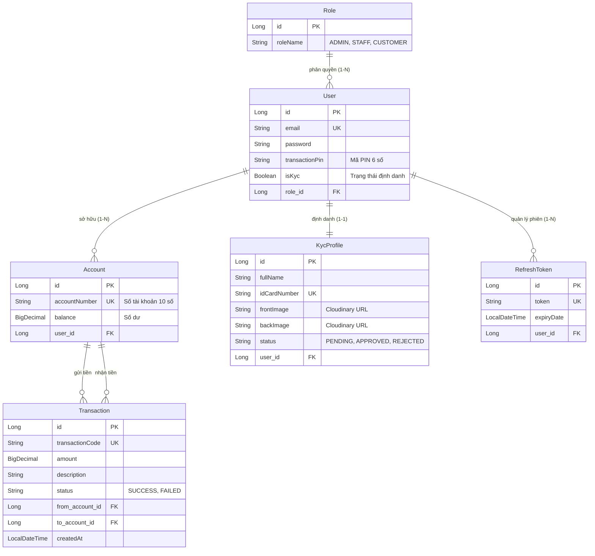

# Kiến Trúc Hệ Thống & Workflows - Rikkei Bank

Skill này chứa toàn bộ thông tin gốc về cấu trúc Database (ERD) và các luồng nghiệp vụ (Workflows) cốt lõi của dự án Rikkei Bank. Bất cứ khi nào bạn cần viết tính năng mới hoặc sửa lỗi liên quan đến Database, hãy tham chiếu bộ tài liệu này.

## 1. Sơ đồ cơ sở dữ liệu (ERD)

## 2. Core Workflows (Luồng Nghiệp Vụ Chính)

### A. Luồng Đăng nhập & Xác thực (Auth Workflow)
1. Khách hàng gọi API `/api/v1/auth/login`.
2. Hệ thống kiểm tra Email và Password (BCrypt).
3. Nếu thành công, cấp phát 1 `AccessToken` (JWT - Hạn 1 tiếng) và 1 `RefreshToken` (Lưu DB - Hạn 7 ngày).
4. Khách hàng dùng AccessToken để gọi các API khác.
5. Khi AccessToken hết hạn, khách hàng gọi `/api/v1/auth/refresh` bằng RefreshToken để lấy AccessToken mới.
6. Khi Đăng xuất, AccessToken được lưu vào Redis `TokenBlacklist` (cơ chế TTL) và RefreshToken bị xóa mềm/hard-delete khỏi DB.

### B. Luồng Định Danh (eKYC Workflow)
1. Khách hàng (Role: Public/Customer) gọi API upload CCCD lên Cloudinary.
2. Hệ thống tạo bản ghi `KycProfile` với trạng thái `PENDING`.
3. Nhân viên/Quản trị viên (Role: ADMIN hoặc STAFF) lấy danh sách hồ sơ `PENDING`.
4. Nhân viên duyệt hồ sơ (Approve).
5. Hệ thống tự động kích hoạt cờ `isKyc = true` cho User.
6. Hệ thống tự động sinh 1 bản ghi `Account` (Tài khoản thanh toán gốc) cho User.

### C. Luồng Chuyển Tiền & Vấn Tin (Transaction Workflow)
1. **Kiểm tra đầu vào:** Nhận `sourceAccountId`, `targetAccountNumber`, `amount`, `transactionPin`.
2. **Xác thực PIN:** Hệ thống băm (Hash) PIN đầu vào và so sánh với PIN trong DB.
3. **Lock dữ liệu:** Áp dụng `Pessimistic Locking` (Lock cả 2 Account) theo thứ tự từ điển của số tài khoản để chống Deadlock và Double-spending.
4. **Kiểm tra số dư:** Nếu số dư thẻ nguồn < số tiền chuyển -> Báo lỗi `INSUFFICIENT_BALANCE`.
5. **Giao dịch:** Trừ tiền thẻ nguồn, cộng tiền thẻ đích.
6. **Lưu vết:** Tạo 1 bản ghi `Transaction` duy nhất liên kết với cả 2 thẻ.
7. **Sao kê:** Khi khách hàng xem lịch sử, query bằng `from_account_id = X OR to_account_id = X`, đánh nhãn động `DEBIT` (nếu là người gửi) hoặc `CREDIT` (nếu là người nhận).

## 3. Kiến Trúc 1-N (Multi-Account Architecture)
- Từ Phase 6 trở đi, một User có thể mở nhiều thẻ `Account`. 
- Bất kỳ API nào liên quan đến tra cứu số dư hay chuyển tiền đều BẮT BUỘC phải nhận một tham số `accountId` để định danh chính xác thẻ nào đang được thao tác.
- Luôn phải kiểm tra tính sở hữu (Ownership): `accountId` đó có thuộc về `userId` đang gọi API hay không (Chống IDOR).
